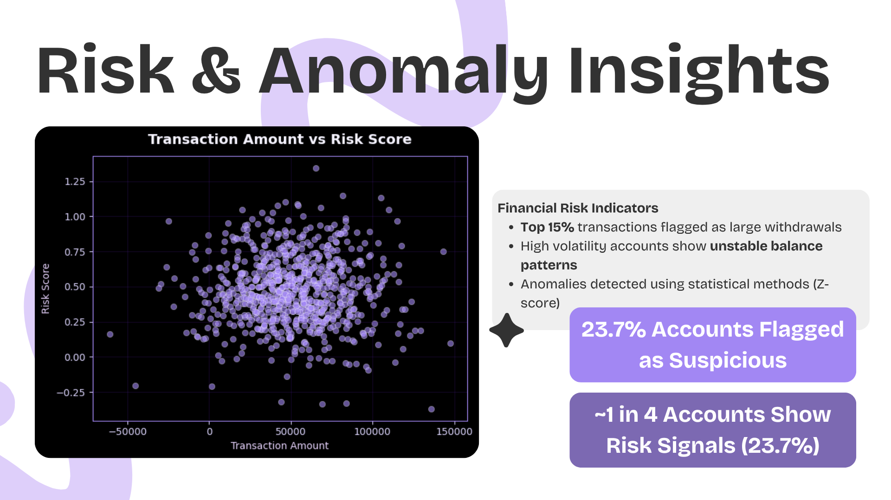
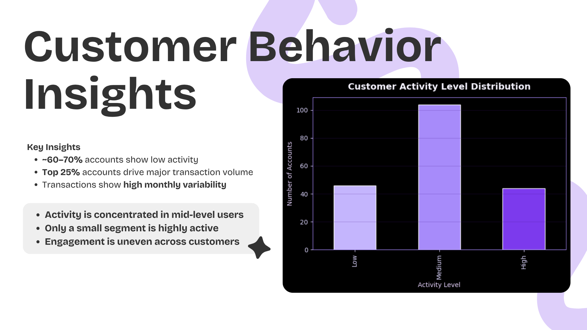

# 📊 Financial Risk Analysis using Python

🚀 This project demonstrates an end-to-end data analysis workflow — from raw financial data to meaningful business insights.

---

## 🔍 Problem Statement
Financial institutions need to identify risky transactions and understand customer behavior patterns to reduce potential losses and improve decision-making.

---

## ⚙️ Tools & Technologies
- Python  
- Pandas  
- NumPy  
- Jupyter Notebook / Google Colab  

---

## 📁 Dataset
- Structured financial dataset (CSV format) containing transaction details, risk scores, and customer activity data  

---

## 🔄 Project Workflow
- Data cleaning and preprocessing  
- Handling missing values and inconsistencies  
- Exploratory Data Analysis (EDA)  
- Risk pattern identification  
- Customer behavior analysis  
- Insight generation and recommendations  

---

## 📊 Key Insights

### 🔍 Risk & Anomaly Insights

- ~23.7% accounts flagged as suspicious  
- Top 15% transactions identified as high-value withdrawals  
- High volatility accounts show unstable balance patterns  
- Anomalies detected using statistical methods (Z-score)  

---

### 👥 Customer Behavior Insights

- ~60–70% accounts fall into low activity segment  
- Top 25% users contribute majority of transaction volume  
- Transactions exhibit high monthly variability  
- Activity is concentrated among mid-level users  

---

## 📎 Project Files
- `01_Python_Code_Financial_Risk_Analysis.ipynb` → Full analysis code  
- `05_Dataset.csv` → Raw dataset  
- `02_Project_Summary_Report.pdf` → Detailed report  
- `03_Presentation_Slides.pdf` → Visual presentation  
- `04_Video_Link.txt` → Project walkthrough  

---

## 🎯 Outcome
This project highlights the ability to transform raw financial data into actionable insights, supporting risk detection and better business decisions.

---

## 💡 Key Takeaway
Not just analyzing data — but identifying patterns that matter.

---
